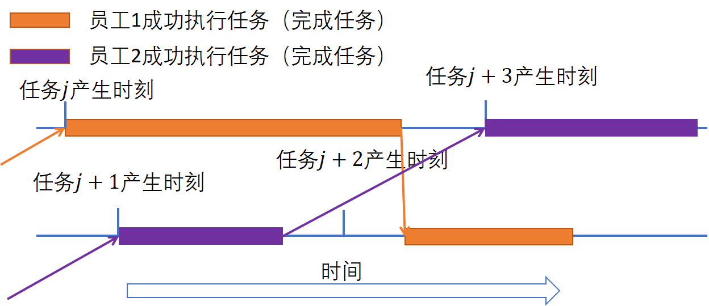
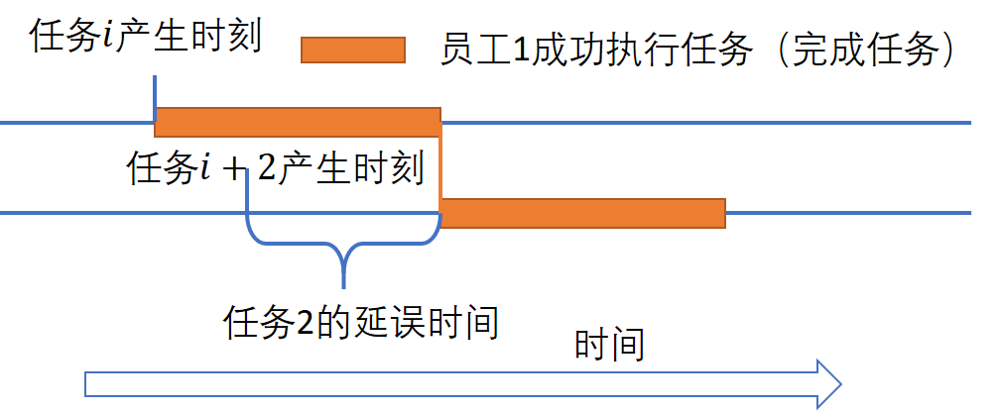
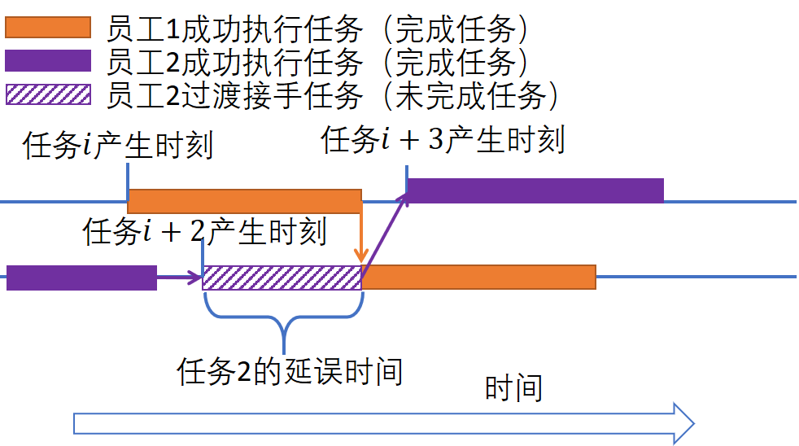
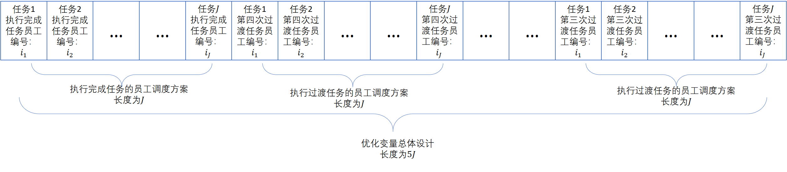
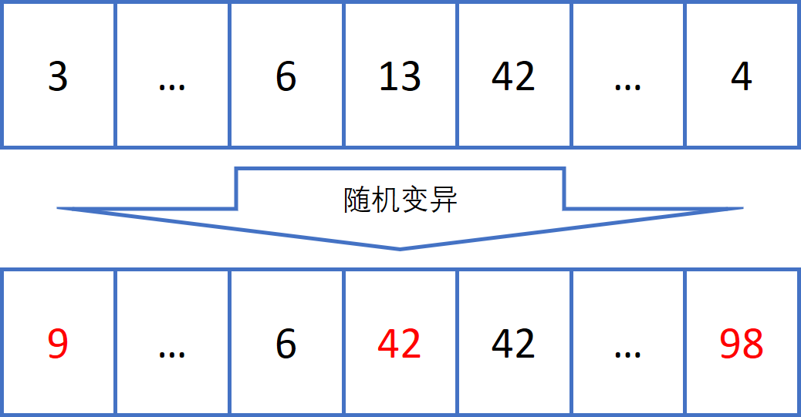
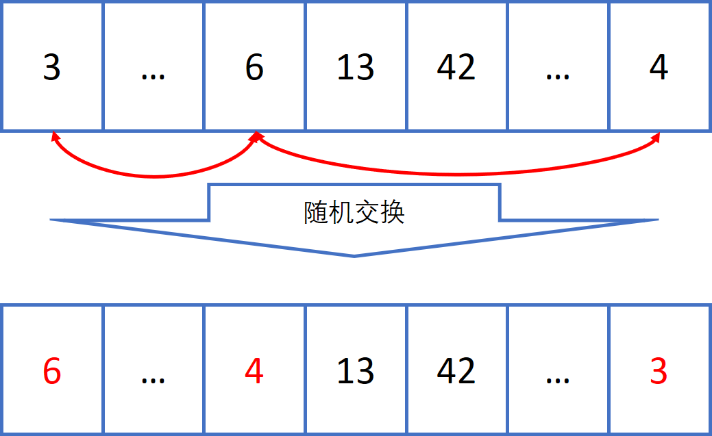

# 阿里云服务调度比赛说明文档

> [**Performance Analysis of Evolutionary Computation Based on Tianchi Service Scheduling Problem**](http://www.eng.niigata-u.ac.jp/~yujun/paper/ICSI2021.pdf),        
> [Jun Yu](https://www.eng.niigata-u.ac.jp/~yujun/), [Yuhao Li](https://scholar.google.com/citations?user=Mga2VloAAAAJ&hl=zh-CN), Tianwei Zhou, Churong Zhang, Guanghui Yue, Yunjiao Ge <br>
> *ICSI 2021*  

author: 李宇豪(Yuhao Li)   email: yuhaoli95@outlook.com

[比赛官网](https://tianchi.aliyun.com/competition/entrance/531831/introduction?spm=5176.12281925.0.0.72d36bfa3LOXw7)

成绩

初赛: 16

复赛: 13

## 比赛业务场景描述

## 数学模型

### 比赛及业务描述

详见：[阿里云数智服务创新挑战赛——服务调度比赛](https://tianchi.aliyun.com/competition/entrance/531831/information)。

比赛的业务场景为：在一段时间内会产生$J$个任务，需要由$I$个专家处理，每个任务对于一个类别，每个专家都有其技能集合（即一个专家能够处理多个类别的任务，但是处理不同类别任务的处理时长可能不同）。

### 条件与约束总结

1. 一个专家可以在同一时刻最多处理3个任务。假设在10：00产生了4个任务，则最少需要两名专家处理；
2. 每个任务都必须被完成，覆盖率100%；
3. 默认每个任务一旦分配给技术专家立即开始处理，该专家可以处理完该任务，也可以将该任务转给其他专家处理（不能再次转给自己），但是一个专家最少处理1分钟；
4. 任务在分配后允许被再次分配给其他服务技术专家，但每个任务被分配的次数不超过5次；
5. 当有多个专家都参与同一个任务时，需要满足处理时间的约束，即第$k ( 2 \leq k \leq 5 )$个员工开始处理第$j$个任务的开始时间 $t_{j,k}^{start}$ 不能晚于处理该任务的前一个$k - 1$专家的结束时间 $t_{j,k-1}^{end}$:

$$
t_{j,k-1}^{end} = t_{j,k}^{start}
$$

### 调度优化目标

在满足要求约束的前提下，算法需要决定某个专家$i$在某个时刻$t$执行某个合适的任务$j$，使得顾客提出问题后的等待时间最小，专家处理问题的效率更高，且专家们的工作时长相对均衡。

### 问题分析

总体思路：

1. 首先不考虑一个任务可以在多个员工之间转移的条件，从最基础的员工-任务匹配的调度问题处理。
2. 当员工无法及时响应任务的时候，允许其他可以处理该类型任务的空闲员工接手过渡处理，以提高任务的响应率。

如果不考虑任务可以在不同员工之间转移的条件，单从任务的完成情况考虑，只需要安排$J$个员工处理$J$个任务就能满足赛题的要求，即每个任务只需要一名员工执行完成。如下图所示：


一旦出现了员工无法准时响应任务的情况时，任务就会一直被延误直到员工处理完上个任务后才能响应该任务。结果是顾客的等待时间会增加：


这时可以在任务产生后到员工可以处理任务之前的这个时间段内，先让该任务在其他空闲员工之间转移，以提高任务的响应率，同时还可以平衡员工的工时。


根据上面的描述可知，一个任务由两个阶段组成： 1. 任务最终完成阶段，在此阶段只有1个员工执行，最后只能由1名员工接手处理完这个任务。2. 任务转移阶段： 如果最终完成该任务的，在此阶段任务会被n个员工接手，此阶段可以但是每个员工都不能完成任务；

首先介绍“完成任务”与“过度任务”的定义：

|       定义       | 描述                                                                                                                                                            |
| :---------------: | :-------------------------------------------------------------------------------------------------------------------------------------------------------------- |
|     完成任务     | 表示专家$i$作为第$k_{last}$位专家最终完成任务$j$;                                                                                                         |
|     过渡任务     | 表示专家$i$接手任务$j$后，在完成任务之前将任务转移给其他专家，则任务$j$就是专家$i$的过渡任务；如果任务$j$由第1名专家完成了，则任务$j$没有过渡任务； |
| $S_{i}^{Ctask}$ | 表示员工$i$的“完成任务”列表，任务按照产生时间升序排序，由决策变量$x_{j,k_{last}}$决定；                                                                   |
|    $c_{i,j}$    | 表示任务$j$在员工$i$的“完成任务”列表的序号；                                                                                                              |

为了更好的描述业务场景与计算评分公式，对涉及到的变量与决策变量进行描述：

|            变量            | 定义                                                                                              |
| :-------------------------: | :------------------------------------------------------------------------------------------------ |
|          $S_{I}$          | 表示员工集合；                                                                                    |
|          $S_{J}$          | 表示任务集合；                                                                                    |
|            $i$            | 表示第$i$个员工，其中$1 \leq i \leq I$；                                                      |
|            $j$            | 表示第$j$个任务，其中$1 \leq j \leq J$；                                                      |
|        $k_{last}$        | 表示处理任务$j$的最后一个服务专家，$1 \leq k \leq 5$；                                        |
|            $k$            | 表示某个员工处理某个任务的次序，根据约束，一个任务最多5名员工处理，则$1 \leq k \leq k_{last}$； |
|          $a_{j}$          | 表示第$j$个任务的类型，$a_{j} \in S_{A}$；                                                    |
|     $\tau _{i,a_{j}}$     | 表示第$i$个员工处理第$a_{j}$类问题所花时间；                                                  |
|    $t_{i,j,k}^{start}$    | 表示第$i$个专家作为第$k$个执行人员处理第$j$个任务的任务开始时间；                           |
|     $t_{i,j,k}^{end}$     | 表示第$i$个专家作为第$k$个执行人员处理第$j$个任务的任务结束时间；                           |
|     $t_{i,j}^{stay}$     | 表示任务$j$在服务技术专家$i$处停留的时长；                                                    |
| $t_{j,k_{last}}^{start}$ | 表示任务$j$开始处理时间；                                                                       |
| $t_{j,k_{last}}^{finish}$ | 表示任务$j$完成处理时间；                                                                       |
|   $t_{j}^{generation}$   | 表示任务$j$产生时间；（与官网定义不同）                                                         |

决策变量介绍：

|      决策变量      | 定义                                                                                                                                                                                                                                                                 |
| :----------------: | :------------------------------------------------------------------------------------------------------------------------------------------------------------------------------------------------------------------------------------------------------------------- |
| $x_{j,k_{last}}$ | 表示执行任务$j$的“完成任务”的专家编号,表示最后由专家$i$执行完成，其中$1 \leq k_{last} \leq 5$, $x_{j,k_{last}} \in S_{I}$；                                                                                                                                |
|    $y_{j,k}$    | 表示执行任务$j$的“过渡任务”的员工编号，表示第$i$个专家作为第$k$个执行人员中间过渡处理处理第$j$个任务，其中$1 \leq k \leq k_{last}$，$y_{j,k} \in S_{I}$，不允许中间过渡员工完成该任务，且执行该过渡任务不能影响该员工$i$处理其下一个的“完成任务”； |

### 优化目标

优化目标详见：[阿里云数智服务创新挑战赛——服务调度比赛：评测方案](https://tianchi.aliyun.com/competition/entrance/531831/information)。

## 算法设计与描述

### 模型具体实现

相关变量计算：

1. 员工$i$作为第$k_{last}$次处理问题的员工处理任务$j$的最终开始时间：

$$
t_{j}^{start} = max(freemoment_{i}, t_{j}^{begin})
$$

2. 员工$i$处理任务$j$后的空闲时间（被释放时间）及任务最终完成时间：

$$
t_{j}^{finish} = freemoment_{i} = t_j^{start} + \tau_{i,a_{j}}
$$

3. 第$i$个专家作为第$k$个执行人员处理第$j$个任务的任务开始结束时间：

$$
t_{i,j,k}^{start} = \left\{
\begin{array}{l c l}
max(freemoment_{i}, t_{j}^{begin})       &      & {k      =      1}\\
t_{i,j,k - 1}^{end}     &      & {1 < k < k_{last}}
\end{array} \right.
$$

$$
t_{i,j,k}^{end} = \left\{
\begin{array}{l c l}
t_{i,j,k+1}^{start}     &      & {k      <      k_{last-1}}\\
t_{j}^{start}     &      & {k = k_{last-1}}
\end{array} \right.
$$

约束处理：

1. 业务场景中，允许一名任务同时最多处理3个不同的任务，则可以将一名员工虚拟成3名不同的员工，各自独立任务。这样处理可以在满足约束的条件下最大限度地利用专家响应任务。
2. 过度任务约束处理

### 优化算法设计

由于任务规模大，优化难度大，所以采用基础的(1+1)-ES(Evolutationary Strategy)算法对模型进行优化求解。

1. 编码设计如下，一个解包含$5*J$（$J$：任务个数）个基因：
   
2. 优化算子采取基础的“随机k-opt变异算子”与“随机k-opt交换算子”进行优化：
   a). 随机k-opt变异算子说明如下：
   在一个解中(调度方案种)，随机选择$k$个基因（变量），每个变量都随机变成另一个值。
   
   b). 随机k-opt交换算子说明如下：
   在一个解中(调度方案种)，随机选择$k$个基因（变量），交换他们的取值。
   

## 运行说明

### 运行环境说明

开发环境：WSL Ubuntu 18.04 LTS
编程语言：C++(11)
GCC版本：GCC7.5.0
编译工具：CMake
项目结构：

```
.
├── data
│   └── SIC_round1_testA_20200909
│       ├── process_time_matrix.csv
│       └── work_order.csv
├── prediction_result
│   └── result.csv
├── heads
│   ├── common.h
│   └── ec.h
├── code
│   ├── evaluation_model
│   │   ├── calculate_score.cpp
│   │   ├── fitness.cpp
│   │   └── process_task.cpp
│   ├── multi_local_search
│   │   ├── k_opt_mutation.cpp
│   │   ├── k_opt_swap.cpp
│   │   └── local_search.cpp
│   ├── get_bounds.cpp
│   ├── iniltialization.cpp
│   ├── input_data.cpp
│   ├── main.cpp
│   ├── scorer.cpp
│   └── tools.cpp
├── main.sh
├── CMakeLists.txt
└── README.md
```

可执行文件路径：``./build/tianchi``

基础数据文件夹：``./data/SIC_round1_testA_20200909/``

1. 任务基础数据路径：``./data/SIC_round1_testA_20200909/work_order.csv``
2. 专家处理任务时长基础数据路径：``./data/SIC_round1_testA_20200909/process_time_matrix.csv``

调度结果保存在 ``./prediction_result/result.csv``中，最终生成的解保存在文件 ``./prediction_result/ind_info.csv``中。

程序最大运行时长保存为全局变量：``MaxRunningTime``(./code/main.cpp)，单位秒

程序运行 ``MaxRunningTime - 10`` 秒后，退出循环，保存结果

程序运行入口：``./code/main.sh``
